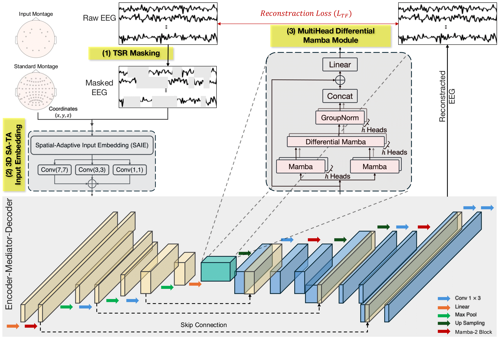

# EEGMS: An Improved Version of EEGM2 with 3D Spatial-Adaptive Input Embedding  
**Update: May 2025**

We introduce **SAMBA**, an enhanced version that incorporates a **3D Spatial-Adaptive Input Embedding** and an **optimized mediator module** for improved spatiotemporal representation and downstream performance.

The model architecture is available under `Code/models/`. The accompanying paper is currently in preparation, and more features will be released soon.



## Repository Structure  
```plaintext
EEGMS/
├── Code/                # Main directory for self-supervised learning and downstream tasks
│   ├── models/          # Includes EEGM2 and EEGMS variants
│   └── utility/         # Supporting functions (e.g., masking, evaluation)
├── Figures/             # Diagrams and visual illustrations
├── Montage/             # Electrode montages for different EEG headsets
├── Env-requirement/     # Environment configuration backups (with dates)
└── README.md            # Project overview and documentation

```
